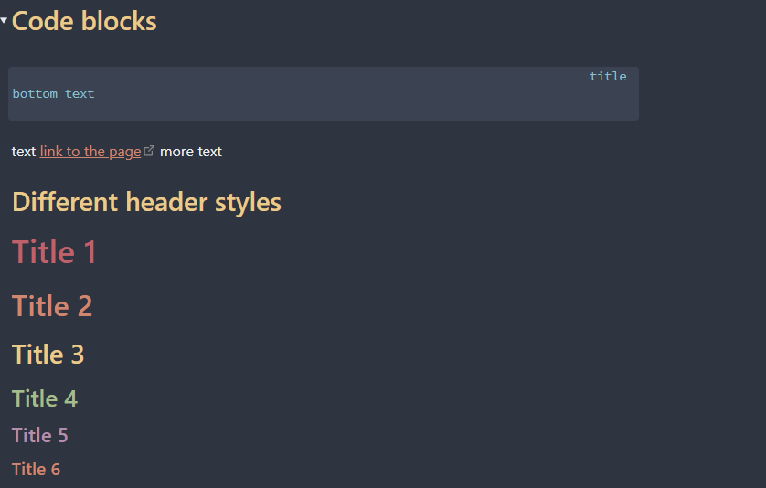
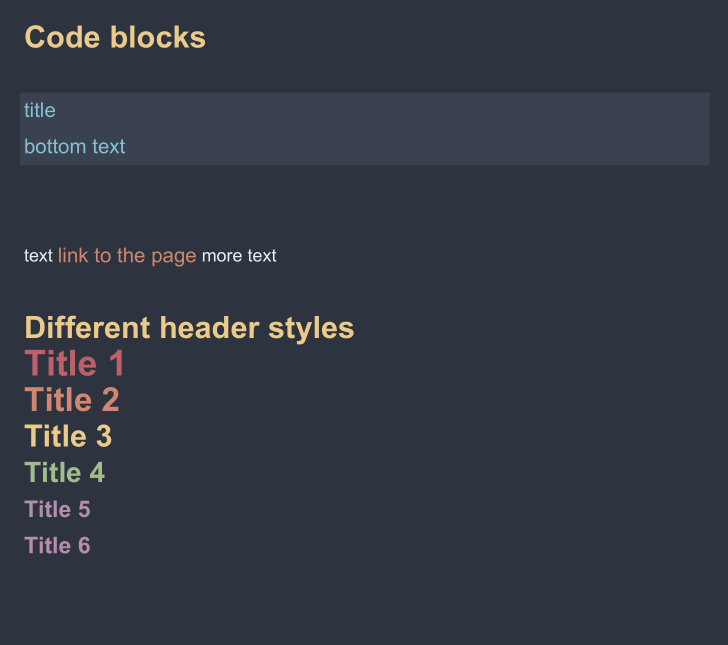

 <!-- PROJECT SHIELDS -->
<!--
*** I'm using markdown "reference style" links for readability.
*** Reference links are enclosed in brackets [ ] instead of parentheses ( ).
*** See the bottom of this document for the declaration of the reference variables
*** for contributors-url, forks-url, etc. This is an optional, concise syntax you may use.
*** https://www.markdownguide.org/basic-syntax/#reference-style-links
-->
[![Contributors][contributors-shield]][contributors-url]
[![Forks][forks-shield]][forks-url]
[![Stargazers][stars-shield]][stars-url]
[![Issues][issues-shield]][issues-url]

<br />
<div align="center">
  <h1 align="center">Obsidian Markdown to PDF converter</h3>

  <p align="center">
    <a href = "https://obsidian.md/">Obsidian</a> markdown to pdf converter
    <br />
    <a href="https://github.com/Altair200333/ObsidianMDtoPDF/blob/main/print_pdf_demo.ipynb"><strong>See the example»</strong></a>
    <br />
    <br />
    <a href="https://github.com/Altair200333/ObsidianMDtoPDF/issues">Report Bug</a>
    ·
    <a href="https://github.com/Altair200333/ObsidianMDtoPDF/issues">Request Feature</a>
  </p>
</div>

<!-- ABOUT THE PROJECT -->
## About The Project

Obsidian allows you to create beautiful documents but normal Md to PDF convertes do not pay attention to it's styles, so i decided to create my own converter that would do that.

## Usage

```
# import styles
pool = import_obsidian_styles("your_style.css")
# read your document
file_text = read_contents("your_document.md")

# create PDF document
pdf = PrintablePDF()
# write to it
convert_md_to_pdf(file_text, pdf, pool)
# save document
pdf.output("output.pdf")
```

<br>
<hr>

## Reference - Left; Right - Converted




<br>

<!-- ROADMAP -->
## Roadmap

- [x] Convert text headers
- [x] Process links
- [ ] Process images
- [ ] Turn it into Obsidian extention 

<!-- MARKDOWN LINKS & IMAGES -->
<!-- https://www.markdownguide.org/basic-syntax/#reference-style-links -->
[contributors-shield]: https://img.shields.io/github/contributors/Altair200333/ObsidianMDtoPDF?style=for-the-badge
[contributors-url]: https://github.com/Altair200333/ObsidianMDtoPDF/graphs/contributors
[forks-shield]: http://img.shields.io/github/forks/Altair200333/ObsidianMDtoPDF?style=for-the-badge
[forks-url]: http://github.com/Altair200333/ObsidianMDtoPDF/network/members
[stars-shield]: http://img.shields.io/github/stars/Altair200333/ObsidianMDtoPDF?style=for-the-badge
[stars-url]: http://github.com/Altair200333/ObsidianMDtoPDF/stargazers
[issues-shield]: https://img.shields.io/github/issues/Altair200333/ObsidianMDtoPDF?style=for-the-badge
[issues-url]: https://github.com/Altair200333/ObsidianMDtoPDF/issues
[product-screenshot]: images/screenshot.png
